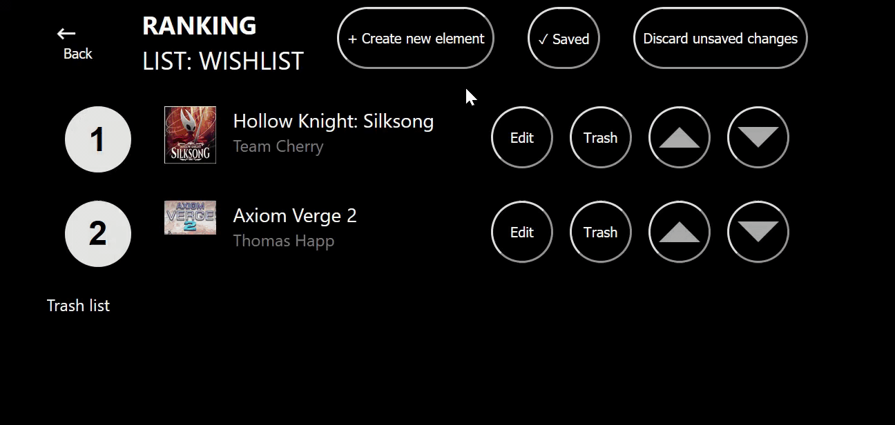

# Ranking app (work in progress)
A little app for ranking your own defined elements, and saving the changes permanently.



## Open web app (serve locally)
This app isn't on a public server, it has to be served locally.

You can choose to either serve this app using Docker or XAMPP. I've written guides for both. For a Docker guide, read further, for a XAMPP guide, go to [this README](https://github.com/paalss/Ranking-app/blob/master/www/app/README.md).

**Prerequisites**

* Git

* Docker

**Start Docker Desktop**

**Download source code and run containers**

Open your commmand line, eg. Git Bash, navigate to where you want to download the project and run these commands:

```
git clone https://github.com/paalss/Ranking-app.git

cd Ranking-app/

cp sample.env .env

docker-compose up -d
```

If docker-compose up -d returns `ERROR: Service 'webserver' failed to build: The command '/bin/sh -c apt-get -y`, you might want to rebuild the container, using:

```
docker-compose build --no-cache
```

**Import database to your MySQL server**

1. Open PhpMyAdmin by going to [localhost:8080](http://localhost:8080) in a browser

2. In the interface, click the “import” tab. On this page, click “browse”, find and choose ranking_app.sql (`database/ranking_app.sql`), then click “Go” at the bottom of the page.

**Open the site in a browser**

[localhost/app/](http://localhost/app/)

If everything worked correctly, you should see a premade list (named “wishlist”) on the page.

<!-- ## Run automatic tests (jest&puppeteer)

**Navigate to the app folder and install the dependencies**

```
cd www/app/
npm install
```

**Run tests**

```
npm test
``` -->

## I've used code from 
* sprintcube/docker-compose-lamp for making this app serve-able with Docker. See more: https://github.com/sprintcube/docker-compose-lamp

* SortableJS/sortablejs for drag and drop functionality. See more: https://github.com/SortableJS/sortablejs